# hqgit build order: the spec DAG, rendered

Generated from `spec-spine registry list --json` by the architect on
2026-09-02, refreshed 2026-09-03 when 003 landed; regenerate after any
change to `depends_on` or `wave`.
Prose, not authority: the specs govern, this page only renders them.

The orchestrator schedules the lowest-numbered spec that is `approved`,
`implementation: pending`, and whose every dependency is shipped at its
pinned hash. Because every dependency is lower-numbered (enforced by
`scripts/spec-dag.sh`), ordinal order is a valid topological order, and the
waves below are the thesis's eight build steps (spec 002 §6).

Totals: 68 specs; longest dependency chain 19 deep.

## Wave 1

| id | title | layer | kind | risk | depth | depends on | units |
|---|---|---|---|---|---|---|---|
| 000-hqgit-bootstrap | Bootstrap spec system for hqgit (specify first, build by spec) | governance | constitutional-bootstrap | critical | 0 | none | 0 |
| 001-agentic-harness | Agentic engineering harness: session protocol, skills, agents, hooks, gate | governance | governance | high | 1 | 000 | 15 |
| 002-platform-thesis | Platform thesis: a verifiable evidence ledger for software change | governance | thesis | critical | 1 | 000 | 8 |
| 003-chassis-alignment | Chassis alignment: what the hosted edge consumes from rahi, and what stays hqgit's | governance | governance | critical | 2 | 002 | 0 |
| 010-workspace-and-core-types | Cargo workspace and the core types: Hash, Cid, Principal, keys, Hlc, Error | l2-domain | kernel | critical | 2 | 002 | 13 |
| 011-canonical-encoding | Canonical encoding: deterministic DAG-CBOR, the Value model, envelopes, unknown-field preservation | l1-ledger | kernel | critical | 3 | 010 | 9 |
| 012-hash-stability-gate | Hash stability gate: fuzz targets, the golden-vector walk, and the cross-platform CI matrix | l1-ledger | tooling | critical | 4 | 011 | 7 |
| 013-object-store | Object store: content-addressed blob and tree objects, the ObjectStore trait, memory and local backends | l0-objects | kernel | critical | 4 | 011 | 8 |
| 014-content-defined-chunking | Content-defined chunking: FastCDC with frozen parameters and the chunked blob manifest | l0-objects | kernel | high | 5 | 013 | 8 |
| 015-verified-streaming | Verified streaming: BAO outboard trees, range proofs, and lazy fetch that never trusts a byte | l0-objects | kernel | high | 6 | 014 | 9 |
| 016-remote-object-backend | Remote object backend: an S3-compatible store and the layered read-through cache | l0-objects | feature | medium | 7 | 013, 015 | 6 |
| 017-ledger-entry-dag | Ledger entry and the hash-linked DAG: shape, signing bytes, append, verify | l1-ledger | kernel | critical | 5 | 011, 013 | 9 |
| 018-deterministic-total-order | Deterministic total order over the DAG and hybrid logical clock generation | l1-ledger | kernel | critical | 6 | 017 | 4 |
| 019-facts-and-derived-state | Facts and derived state: the immutable fact envelope, the registry seam, LWW registers, and the reserved sequence CRDT | l1-ledger | kernel | critical | 7 | 018 | 8 |
| 020-commitments-and-tombstones | Commitments and tombstones: content indirection, per-namespace encryption, and erasure that keeps the chain verifiable | l1-ledger | kernel | critical | 8 | 019 | 11 |
| 021-local-repository | Local repository: the .hq layout, the persistent entry store, namespaces, and the append path | l1-ledger | kernel | high | 9 | 020 | 7 |
| 023-domain-fact-vocabulary | Domain fact vocabulary: the typed facts, their ids, and their validation | l2-domain | kernel | high | 8 | 019 | 7 |
| 024-change-and-revision | Change and Revision: stable change identity over an ordered revision sequence | l2-domain | kernel | high | 9 | 023 | 5 |
| 025-semantic-anchors | Semantic anchors: comments that survive rebase by resolving against content | l2-domain | kernel | high | 10 | 024 | 10 |
| 026-review-threads | Review threads: anchored comments, resolution state, and approvals as attestations | l2-domain | feature | medium | 11 | 025 | 4 |
| 027-attestation-primitive | The attestation primitive: one signed evidence shape, a predicate registry, in-toto interop | l2-domain | kernel | critical | 9 | 023 | 7 |
| 028-issues-and-derived-state | Issues as facts with converging derived state: registers and an add-wins label set | l2-domain | feature | medium | 9 | 023 | 4 |
| 031-git-object-bridge | Git object bridge: gix import and export, the bidirectional oid map, worktree snapshots | l0-objects | kernel | high | 6 | 014 | 10 |
| 032-cli-skeleton | The hq binary: clap frame, exit codes, JSON output, init, status, log | l7-edge | kernel | high | 10 | 021 | 10 |
| 033-cli-offline-review | Offline review from the CLI: changes, revisions, anchored threads, approvals | l7-edge | feature | high | 12 | 032, 031, 026, 027 | 7 |
| 034-cli-attest-and-verify | hq attest and hq verify: issue any attestation, verify the chain and its evidence offline | l7-edge | feature | high | 13 | 033 | 5 |

## Wave 2

| id | title | layer | kind | risk | depth | depends on | units |
|---|---|---|---|---|---|---|---|
| 040-github-mirror-import | GitHub mirror import: issues, pull requests, reviews, and checks become quarantined facts | l7-edge | feature | high | 12 | 028, 026, 027, 031 | 12 |
| 041-github-mirror-export | GitHub mirror export and reconciliation: local facts back to GitHub, loop-safe and idempotent | l7-edge | feature | high | 13 | 040 | 5 |
| 042-mirror-sync-command | hq mirror: the sync loop with cursors, backoff, and reports | l7-edge | feature | medium | 14 | 041, 032 | 7 |

## Wave 3

| id | title | layer | kind | risk | depth | depends on | units |
|---|---|---|---|---|---|---|---|
| 050-stacked-changes | Stacked changes: dependency facts, a deterministic stack order, restack plans, and interdiff | l2-domain | feature | high | 10 | 024 | 6 |
| 051-semantic-deltas | Semantic deltas: API surface, dependency, and capability changes as attestations | l2-domain | feature | high | 11 | 027, 050, 025 | 10 |
| 052-semantic-conflicts | Semantic conflicts: pairwise conflict detection over deltas and anchors, with text kept separate | l2-domain | feature | medium | 12 | 051 | 6 |

## Wave 4

| id | title | layer | kind | risk | depth | depends on | units |
|---|---|---|---|---|---|---|---|
| 060-identity-and-key-rotation | Identity as a keypair with a rotation chain recorded in the ledger | l4-trust | kernel | critical | 8 | 019 | 7 |
| 061-oidc-login | OIDC login: authorization code with PKCE, device flow, and subject binding | l4-trust | feature | high | 9 | 060 | 7 |
| 062-transparency-log | Transparency log: Merkle log, inclusion and consistency proofs, signed checkpoints | l4-trust | kernel | critical | 9 | 060 | 7 |
| 063-keyless-signing | Keyless signing: short-lived certificates bound to an OIDC identity, the signature bundle, and bundle verification | l4-trust | feature | high | 10 | 061, 062 | 7 |
| 064-attestation-verification | Attestation verification: the fixed pipeline from signature to verified set | l4-trust | kernel | critical | 10 | 060, 062, 027 | 7 |
| 065-policy-engine | Policy engine: deterministic WASM merge predicates, hash-pinned | l6-policy | kernel | critical | 10 | 027, 024 | 9 |
| 066-policy-sdk | Policy SDK: typed Rust policies compiled to WASM, testable natively | l6-policy | feature | high | 11 | 065 | 12 |
| 067-policy-evaluation-attestation | Policy evaluation as evidence: the policy-eval attestation, replay, and hq policy | l6-policy | kernel | critical | 14 | 065, 034 | 9 |
| 068-policy-in-repo | Policy in the repository: pinned by fact, resolved by clock, no settings table | l6-policy | feature | high | 15 | 067, 021 | 7 |

## Wave 5

| id | title | layer | kind | risk | depth | depends on | units |
|---|---|---|---|---|---|---|---|
| 070-reapi-types | Remote Execution API types: vendored protos, BLAKE3 digests, actions, the CAS adapter | l3-evaluation | kernel | high | 5 | 013 | 12 |
| 071-action-cache | Action cache as a trust boundary: attested entries, gating versus advisory lookups | l3-evaluation | kernel | critical | 11 | 070, 064 | 6 |
| 072-execution-service | Execution service: REAPI Capabilities, CAS, ByteStream, ActionCache, Execution, and the scheduler | l3-evaluation | feature | high | 12 | 071 | 14 |
| 073-sandbox-executor | Sandbox executor: the Go worker with namespace and microVM tiers | l3-evaluation | feature | critical | 13 | 072 | 16 |
| 074-execution-provenance | Execution provenance: every completed action emits a signed SLSA attestation | l3-evaluation | kernel | critical | 13 | 072, 064 | 5 |
| 075-build-graph | Build graph: the hq-build.toml manifest, pinned toolchains, and affected-target selection | l3-evaluation | feature | high | 6 | 070 | 9 |
| 076-merge-queue | Merge queue: speculative evaluation over candidate merge states, batching, and bisection | l3-evaluation | feature | high | 15 | 075, 074, 067 | 5 |

## Wave 6

| id | title | layer | kind | risk | depth | depends on | units |
|---|---|---|---|---|---|---|---|
| 080-projection-framework | Projection framework: disposable read models folded from the total order | l5-projection | kernel | high | 11 | 021, 032 | 13 |
| 081-change-and-review-views | Change and review views: the SQL read models for changes, threads, attestations, stacks | l5-projection | feature | medium | 12 | 080, 026, 027, 050 | 9 |
| 082-search-index | Search index: a tantivy projection over changes, comments, issues, and attestations | l5-projection | feature | medium | 12 | 080 | 6 |
| 083-code-graph | Code graph: a cross-repository SCIP symbol projection keyed by tree | l5-projection | feature | high | 12 | 080, 025 | 10 |
| 084-ecosystem-graph | Ecosystem graph: package dependencies joined to the code graph for downstream impact | l5-projection | feature | high | 13 | 083, 075, 051 | 8 |
| 085-attention-feeds | Attention feeds: a per-principal ranked feed where every item carries its reason | l5-projection | feature | low | 13 | 081 | 6 |
| 090-server-skeleton | The hqgit-server binary: one listener for HTTP and gRPC, config, the repo registry, health, shutdown | l7-edge | kernel | high | 10 | 021 | 11 |
| 091-per-repo-control-plane | Per-repo control plane: one Raft group per repository over hiqlite, proposal, apply, placement | l7-edge | kernel | critical | 11 | 090 | 8 |
| 092-git-endpoint | Git smart HTTP endpoint: refs as a projection of changes, push as revision submission, gated main | l7-edge | feature | high | 16 | 090, 031, 024, 068 | 9 |
| 093-connect-api | The typed API: gRPC and Connect JSON services for changes, reviews, attestations, policy, repos; the CLI remote client | l7-edge | feature | high | 15 | 090, 026, 027, 067, 032, 081 | 28 |
| 094-quarantine-and-promotion | Quarantine and promotion: untrusted writes land quarantined, capabilities are attestations, promotion is a fact | l7-edge | kernel | critical | 12 | 091, 064 | 8 |
| 095-web-review-ui | The web review client: change list, change detail with semantic deltas first, threads, the evidence panel | l7-edge | feature | medium | 16 | 093, 081 | 19 |

## Wave 7

| id | title | layer | kind | risk | depth | depends on | units |
|---|---|---|---|---|---|---|---|
| 100-agent-principals | Agent principals: registration facts, Biscuit tokens, and the caveat vocabulary | l4-trust | kernel | critical | 16 | 060, 068 | 9 |
| 101-delegation-chain | Delegation chain: delegation facts, chain resolution to a human root, and authorize | l4-trust | kernel | critical | 17 | 100 | 6 |
| 102-agent-sandbox-and-provenance | Agent sandbox and provenance: declared sandboxes, the agent-action attestation, and the server seam | l7-edge | feature | high | 18 | 101, 074, 090 | 10 |
| 103-evidence-carrying-changes | Evidence-carrying changes: the bundle, the argument view, and the evidence_required policy | l6-policy | feature | high | 19 | 102, 067, 051 | 13 |
| 104-ownership-and-sla | Ownership with delegation, expiry, and SLA: facts that replace CODEOWNERS | l2-domain | feature | medium | 11 | 028, 060, 025 | 5 |

## Wave 8

| id | title | layer | kind | risk | depth | depends on | units |
|---|---|---|---|---|---|---|---|
| 110-set-reconciliation | Range-based set reconciliation over entry hashes: fingerprints, the split protocol, and ingest | l1-ledger | kernel | high | 10 | 021 | 8 |
| 111-quic-transport | QUIC transport: identity-bound endpoints, the sync session, and the remote object source | l1-ledger | feature | high | 11 | 110, 060 | 7 |
| 112-federation | Federation: peer registries as facts, the server sync driver, holds for unpromoted peers, and hq sync | l7-edge | feature | high | 13 | 111, 094, 032 | 13 |

## The DAG

Edges point from a spec to what it depends on. Wave groupings are subgraphs.

```mermaid
flowchart BT
  subgraph W1["Wave 1"]
    S000["000-hqgit-bootstrap"]
    S001["001-agentic-harness"]
    S002["002-platform-thesis"]
    S003["003-chassis-alignment"]
    S010["010-workspace-and-core-types"]
    S011["011-canonical-encoding"]
    S012["012-hash-stability-gate"]
    S013["013-object-store"]
    S014["014-content-defined-chunking"]
    S015["015-verified-streaming"]
    S016["016-remote-object-backend"]
    S017["017-ledger-entry-dag"]
    S018["018-deterministic-total-order"]
    S019["019-facts-and-derived-state"]
    S020["020-commitments-and-tombstones"]
    S021["021-local-repository"]
    S023["023-domain-fact-vocabulary"]
    S024["024-change-and-revision"]
    S025["025-semantic-anchors"]
    S026["026-review-threads"]
    S027["027-attestation-primitive"]
    S028["028-issues-and-derived-state"]
    S031["031-git-object-bridge"]
    S032["032-cli-skeleton"]
    S033["033-cli-offline-review"]
    S034["034-cli-attest-and-verify"]
  end
  subgraph W2["Wave 2"]
    S040["040-github-mirror-import"]
    S041["041-github-mirror-export"]
    S042["042-mirror-sync-command"]
  end
  subgraph W3["Wave 3"]
    S050["050-stacked-changes"]
    S051["051-semantic-deltas"]
    S052["052-semantic-conflicts"]
  end
  subgraph W4["Wave 4"]
    S060["060-identity-and-key-rotation"]
    S061["061-oidc-login"]
    S062["062-transparency-log"]
    S063["063-keyless-signing"]
    S064["064-attestation-verification"]
    S065["065-policy-engine"]
    S066["066-policy-sdk"]
    S067["067-policy-evaluation-attestation"]
    S068["068-policy-in-repo"]
  end
  subgraph W5["Wave 5"]
    S070["070-reapi-types"]
    S071["071-action-cache"]
    S072["072-execution-service"]
    S073["073-sandbox-executor"]
    S074["074-execution-provenance"]
    S075["075-build-graph"]
    S076["076-merge-queue"]
  end
  subgraph W6["Wave 6"]
    S080["080-projection-framework"]
    S081["081-change-and-review-views"]
    S082["082-search-index"]
    S083["083-code-graph"]
    S084["084-ecosystem-graph"]
    S085["085-attention-feeds"]
    S090["090-server-skeleton"]
    S091["091-per-repo-control-plane"]
    S092["092-git-endpoint"]
    S093["093-connect-api"]
    S094["094-quarantine-and-promotion"]
    S095["095-web-review-ui"]
  end
  subgraph W7["Wave 7"]
    S100["100-agent-principals"]
    S101["101-delegation-chain"]
    S102["102-agent-sandbox-and-provenance"]
    S103["103-evidence-carrying-changes"]
    S104["104-ownership-and-sla"]
  end
  subgraph W8["Wave 8"]
    S110["110-set-reconciliation"]
    S111["111-quic-transport"]
    S112["112-federation"]
  end
  S001 --> S000
  S002 --> S000
  S003 --> S002
  S010 --> S002
  S011 --> S010
  S012 --> S011
  S013 --> S011
  S014 --> S013
  S015 --> S014
  S016 --> S013
  S016 --> S015
  S017 --> S011
  S017 --> S013
  S018 --> S017
  S019 --> S018
  S020 --> S019
  S021 --> S020
  S023 --> S019
  S024 --> S023
  S025 --> S024
  S026 --> S025
  S027 --> S023
  S028 --> S023
  S031 --> S014
  S032 --> S021
  S033 --> S032
  S033 --> S031
  S033 --> S026
  S033 --> S027
  S034 --> S033
  S040 --> S028
  S040 --> S026
  S040 --> S027
  S040 --> S031
  S041 --> S040
  S042 --> S041
  S042 --> S032
  S050 --> S024
  S051 --> S027
  S051 --> S050
  S051 --> S025
  S052 --> S051
  S060 --> S019
  S061 --> S060
  S062 --> S060
  S063 --> S061
  S063 --> S062
  S064 --> S060
  S064 --> S062
  S064 --> S027
  S065 --> S027
  S065 --> S024
  S066 --> S065
  S067 --> S065
  S067 --> S034
  S068 --> S067
  S068 --> S021
  S070 --> S013
  S071 --> S070
  S071 --> S064
  S072 --> S071
  S073 --> S072
  S074 --> S072
  S074 --> S064
  S075 --> S070
  S076 --> S075
  S076 --> S074
  S076 --> S067
  S080 --> S021
  S080 --> S032
  S081 --> S080
  S081 --> S026
  S081 --> S027
  S081 --> S050
  S082 --> S080
  S083 --> S080
  S083 --> S025
  S084 --> S083
  S084 --> S075
  S084 --> S051
  S085 --> S081
  S090 --> S021
  S091 --> S090
  S092 --> S090
  S092 --> S031
  S092 --> S024
  S092 --> S068
  S093 --> S090
  S093 --> S026
  S093 --> S027
  S093 --> S067
  S093 --> S032
  S093 --> S081
  S094 --> S091
  S094 --> S064
  S095 --> S093
  S095 --> S081
  S100 --> S060
  S100 --> S068
  S101 --> S100
  S102 --> S101
  S102 --> S074
  S102 --> S090
  S103 --> S102
  S103 --> S067
  S103 --> S051
  S104 --> S028
  S104 --> S060
  S104 --> S025
  S110 --> S021
  S111 --> S110
  S111 --> S060
  S112 --> S111
  S112 --> S094
  S112 --> S032
```

## Roots and leaves

- Roots (no dependencies): 000-hqgit-bootstrap
- Leaves (nothing depends on them): 001-agentic-harness, 003-chassis-alignment, 012-hash-stability-gate, 016-remote-object-backend, 042-mirror-sync-command, 052-semantic-conflicts, 063-keyless-signing, 066-policy-sdk, 073-sandbox-executor, 076-merge-queue, 082-search-index, 084-ecosystem-graph, 085-attention-feeds, 092-git-endpoint, 095-web-review-ui, 103-evidence-carrying-changes, 104-ownership-and-sla, 112-federation
- Most depended upon: 027-attestation-primitive (7), 060-identity-and-key-rotation (6), 021-local-repository (5), 032-cli-skeleton (5), 013-object-store (4), 024-change-and-revision (4), 025-semantic-anchors (4), 026-review-threads (4)

